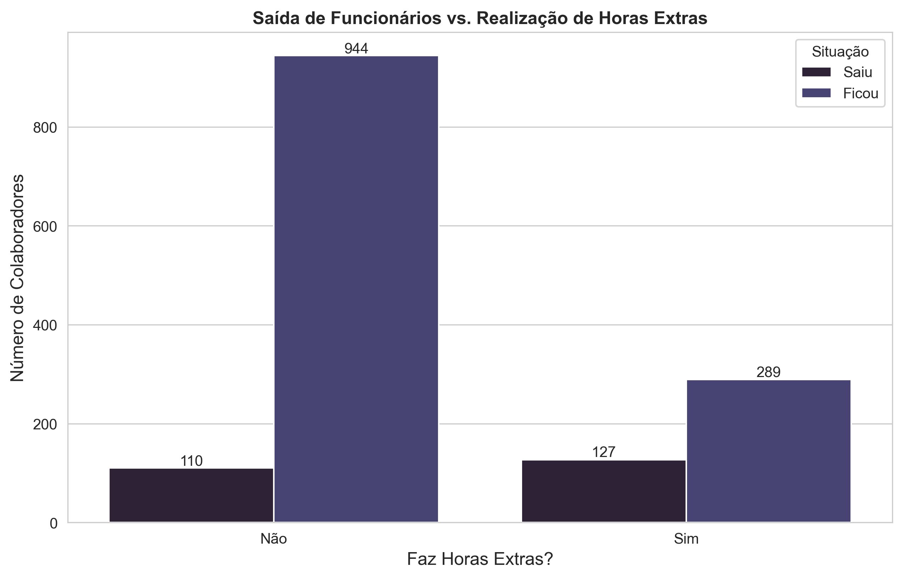
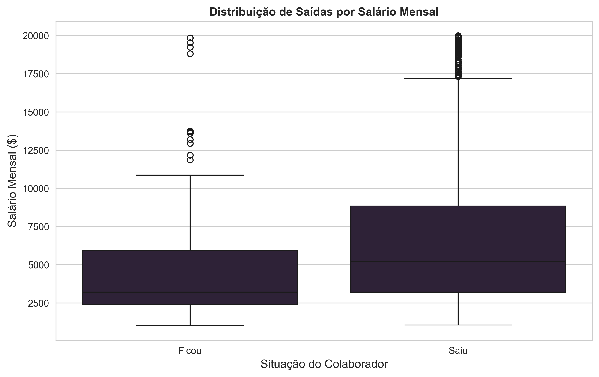
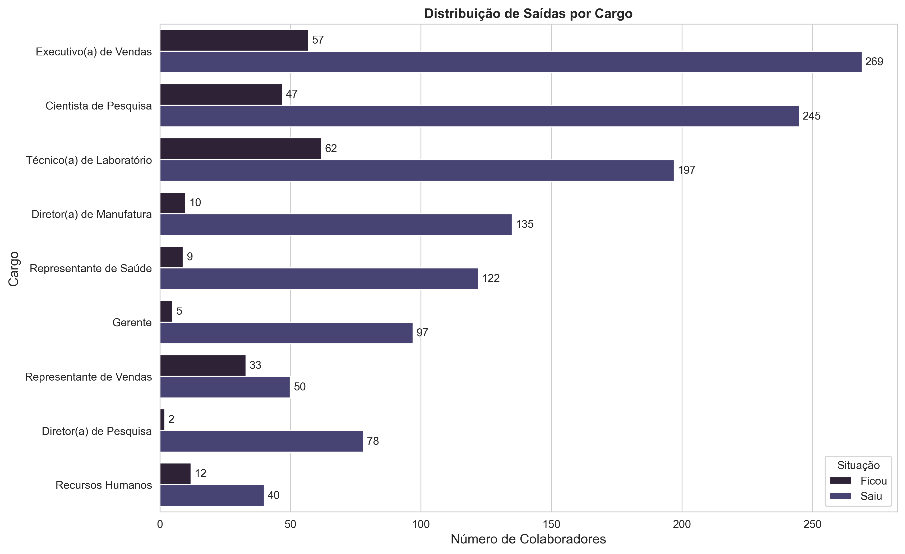
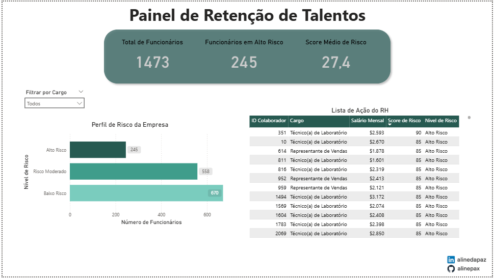

# 📈 Análise Preditiva de Retenção de Talentos

Projeto completo de People Analytics que analisa os fatores de *turnover* (saída de colaboradores), desenvolve um pipeline de dados automatizado para calcular um score de risco e apresenta os resultados em um dashboard interativo no Power BI.

---

## 🎯 Objetivos do Projeto
- Identificar os principais fatores que levam à saída de colaboradores através de uma análise exploratória de dados (EDA).
- Construir um pipeline de dados automatizado em Python que lê dados de uma fonte na nuvem (Google Sheets), aplica uma lógica de negócio e salva os resultados.
- Desenvolver um "Score de Risco" para cada colaborador, permitindo priorizar ações de retenção.
- Criar um dashboard gerencial no Power BI para monitorar os níveis de risco e facilitar a tomada de decisão pelo time de RH e liderança.

---

### 📄 Fonte dos Dados (Data Source)

A análise foi construída sobre duas fontes de dados combinadas para simular um cenário realista:

* **Base de Dados Principal:** Utilizou-se o dataset público clássico "IBM HR Analytics Employee Attrition & Performance", contendo dados de 1.470 colaboradores anonimizados.
    * **Origem:** [Kaggle - IBM HR Analytics Dataset](https://www.kaggle.com/datasets/pavansubhasht/ibm-hr-analytics-attrition-dataset)

* **Dados Sintéticos para Automação:** Para validar o pipeline de automação, foram gerados e adicionados **3 novos registros de colaboradores fictícios**. O objetivo foi simular a entrada de novas contratações no sistema de RH e testar a capacidade do pipeline de processar dados atualizados e calcular o score de risco para os novos funcionários.

A base de dados final utilizada para a automação e para o dashboard contém, portanto, um total de **1.473 registros**.

---

## 📁 Estrutura do Repositório

```
/analise-de-retencao-rh/
|
├── 📂 data/
|   ├── dados_completos_rh.csv                   # Dataset final com dados sintéticos adicionados
|   ├── Base_de_Dados_RH_Automação.csv           # Base final usada na automação com 3 novos colaboradores
|   └── WA_Fn-UseC_-HR-Employee-Attrition.csv    # Dataset original da IBM
|
├── 📂 python/
|   ├── 📂 graficos/                             # Gráficos gerados pela análise exploratória            
|   ├── 📂 insights/                             # Insights retirados da análise exploratória
|   ├── 📂 notebooks/
|       ├── 1_analise_exploratoria.ipynb          # Notebook com a investigação completa e geração de gráficos
|       └── 2_pipeline_automacao.ipynb            # Script enxuto do pipeline de automação
|   
|
├── 📂 powerbi/
|   ├── dashboard_retencao.pbix                   # Arquivo do Power BI com o dashboard
|   └── monitoramento_turnover.png                # Prévia do Dashboard feito no Power BI
|
├── .gitignore                                    # Arquivo para ignorar credenciais e pastas de cache
├── README.md                                     # Documentação completa do projeto
└── requirements.txt                              # Dependências para rodar o notebook

```
---
   
## 🧰 Ferramentas Utilizadas
✅ **Python** — Para todo o processamento, análise e automação.  
✅ **Pandas:** Manipulação e tratamento dos dados.  
✅ **Seaborn & Matplotlib:** Visualização de dados na análise exploratória.  
✅ **Gspread & oauth2client:** Conexão e automação com a API do Google Sheets.  
✅ **Power BI Desktop** — Para a criação do dashboard interativo final.  
✅ **Git & GitHub** (para versionamento e apresentação do projeto)

---

## 📌 Principais Insights da Análise

Abaixo estão os 3 principais insights que nortearam a criação da solução, extraídos a partir da análise exploratória com Python.

### 1. O Custo das Horas Extras


A análise revelou que o **burnout** é um fator crítico. Um funcionário que faz horas extras tem **praticamente 3 vezes mais chance de sair** da empresa. Embora representem apenas 28% da força de trabalho, são responsáveis por mais de 53% de todas as saídas.

---

### 2. A Barreira do Salário e da Carreira


O salário é um claro divisor de águas. Cerca de **75% dos colaboradores que saem ganham menos do que o funcionário mediano que fica**. Isso mostra que a baixa remuneração e a percepção de estagnação na carreira (poucas promoções) são gatilhos decisivos.

---

### 3. As "Zonas Quentes" de Turnover


O turnover não é um problema homogêneo; ele se concentra em cargos específicos. **Representante de Vendas**, **Técnico de Laboratório** e **Recursos Humanos** apresentam as maiores taxas de saída, indicando que os problemas de retenção são mais agudos em funções de entrada ou de suporte operacional.

---

### 📌 Análise Exploratória Completa

Toda a investigação detalhada, com os gráficos e insights que nortearam este projeto, está documentada em uma página dedicada.

➡️ **[Clique aqui para ver a Análise Exploratória Completa](./python/insights/analise_completa.md)**

---

### 🤖 Pipeline de Automação
Para transformar a análise em uma ferramenta contínua, foi desenvolvido um pipeline em Python (`notebooks/2_pipeline_automacao.ipynb`) que:
1.  Lê os dados de colaboradores de uma fonte na nuvem (Google Sheets).
2.  Aplica as rotinas de limpeza e tradução necessárias.
3.  Calcula um "Score de Risco" para cada funcionário com base nos principais fatores identificados (horas extras, satisfação, salário, etc.).
4.  Salva o resultado em uma nova aba na Planilha Google, chamada **'Resultados_Analisados'**. Esta tabela contém **todos os funcionários com seu respectivo Score e Nível de Risco**, ordenados do maior para o menor, criando uma lista de ação priorizada para o RH.

---

## 🖼️ Prévia do Dashboard

Devido às políticas de licenciamento da Microsoft que exigem uma conta corporativa para a publicação pública de relatórios, apresento abaixo uma imagem do dashboard final. O arquivo `.pbix` interativo está disponível na pasta `powerbi/` para quem desejar explorar o modelo de dados e as interações.



---

## 📈 Funcionalidades do Dashboard

O dashboard se conecta diretamente aos dados produzidos pelo pipeline de automação (`Resultados_Analisados`), permitindo um monitoramento contínuo do risco de turnover. Suas principais funcionalidades são:

* **KPIs principais:** Total de Colaboradores, Total de Funcionários em Alto Risco e Score Médio de Risco da Empresa.
* **Lista de Ação para o RH:** Uma tabela detalhada com os funcionários de maior risco, seus cargos, salários e scores, permitindo ação imediata.
* **Filtros Dinâmicos:** Segmentação por Cargo, permitindo que cada gestor analise o risco específico de sua equipe.
* **Visão Geral do Risco:** Um gráfico de barras que mostra a distribuição de todos os colaboradores entre os níveis de risco (Baixo, Moderado e Alto).


---

## 📜 Instruções de Uso
Para replicar o ambiente de automação:
1.  Configure as credenciais da API do Google (o que gerará um arquivo `.json`).
2.  Instale as dependências listadas no `requirements.txt`:
   ```bash
   pip install pandas gspread gspread-dataframe oauth2client
```
3. Execute o notebook `2_pipeline_automacao.ipynb`

---

## 👩‍💻 Sobre a Autora

Desenvolvido por **[Aline Paz](https://github.com/alinepax)**  
📫 Me encontre no [LinkedIn](https://www.linkedin.com/in/alinedapaz/)  
📧 Email para parcerias: aline.santospaz@gmail.com  
🎯 Este projeto faz parte do meu portfólio como profissional em transição para a área de Dados e Tecnologia.

---

⭐ Se você gostou, deixe uma estrela no repositório!

