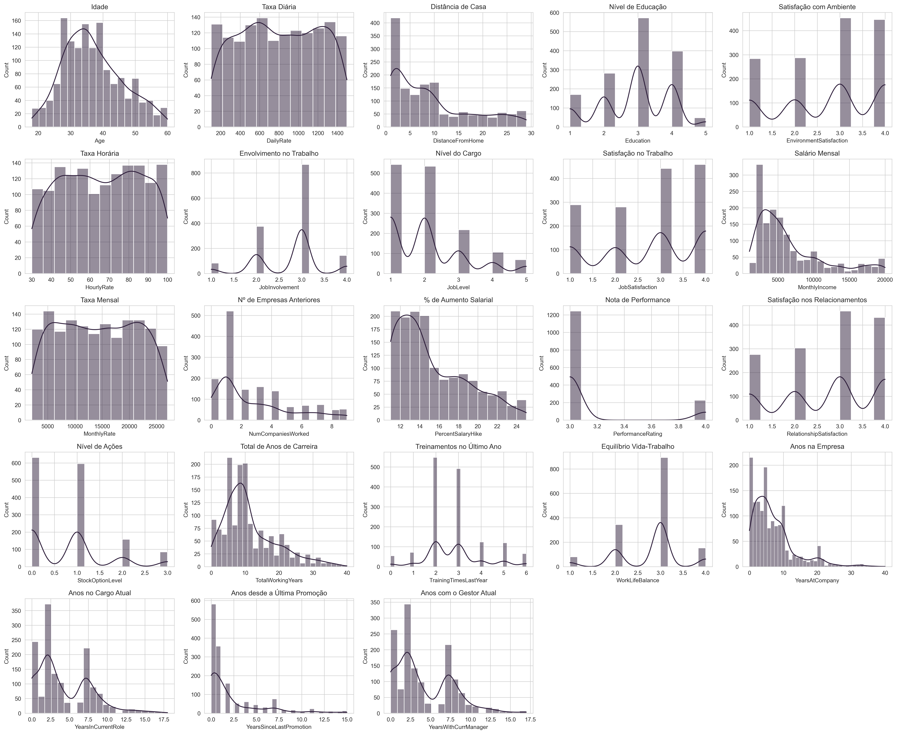
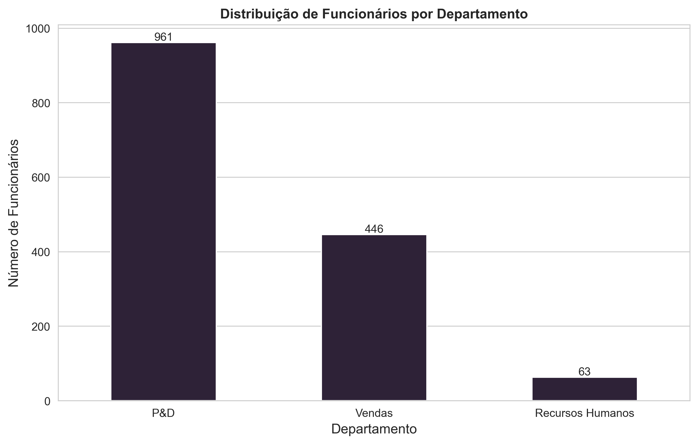
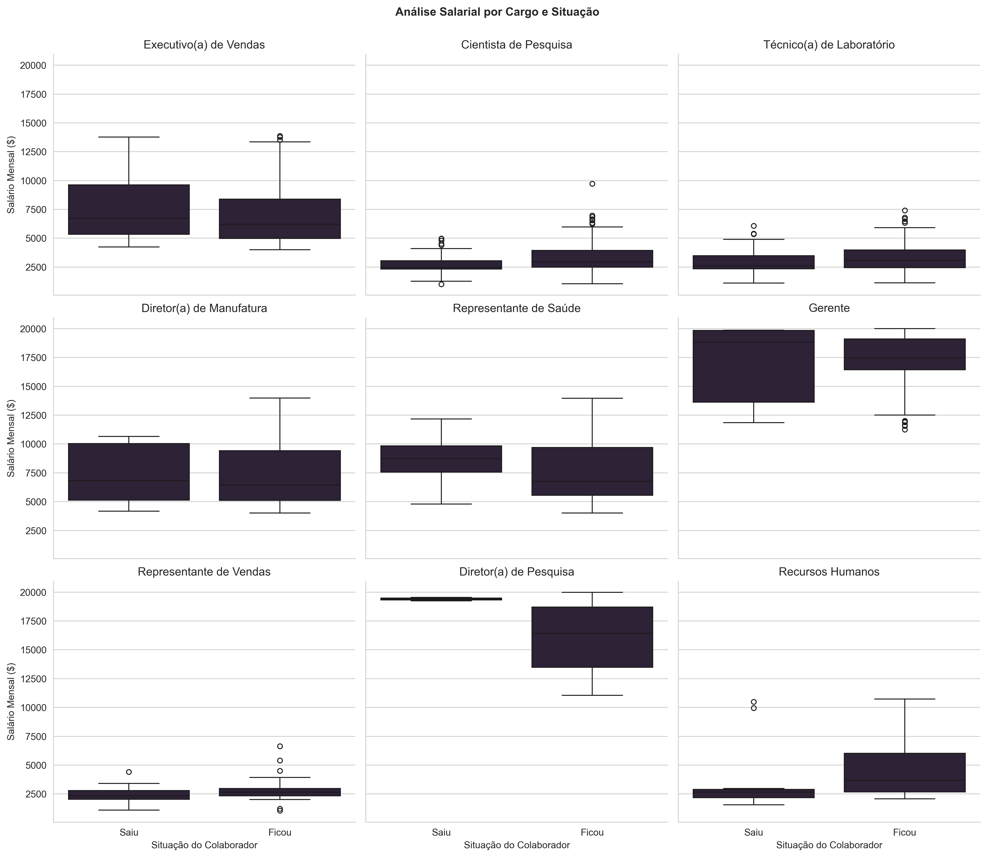
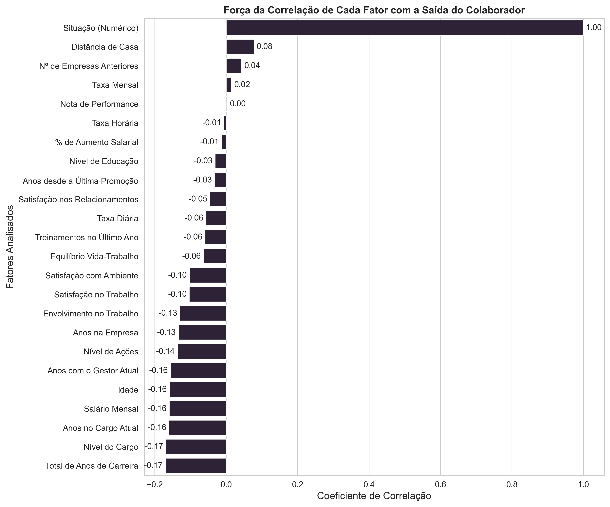

# 🔬 Análise Exploratória Profunda: Decifrando os Fatores de Turnover

Esta página documenta o processo de investigação e as principais descobertas da Análise Exploratória de Dados (EDA) realizada sobre o dataset "IBM HR Analytics". O objetivo desta etapa foi ir além dos dados brutos para encontrar os verdadeiros gatilhos que levam à saída de colaboradores.

Utilizando Python, com as bibliotecas Pandas para manipulação e Seaborn/Matplotlib para visualização, cada seção abaixo detalha uma pergunta de negócio, o gráfico gerado para respondê-la e os insights extraídos.

Estas descobertas serviram como o alicerce para a construção da lógica de "Score de Risco" no pipeline de automação e para o design do dashboard final no Power BI.

---

## 💎 Raio-X da Empresa 💎

Análise dos histogramas de distribuição das variáveis numéricas do dataset.

### 👤 Perfil da Equipe: Madura e Experiente
* **Observação:** O gráfico de `Idade` mostra uma forte concentração de funcionários entre 30 e 40 anos, e o de `Anos de Carreira` tem seu pico em 10 anos.
* **O que isso significa?** A sua força de trabalho é **madura e experiente**, não sendo composta majoritariamente por recém-formados. O pico de 10 anos de experiência é um momento crítico na carreira, ideal para focar em estratégias de retenção para este grupo.

### 💰 A Estrutura Salarial: Uma Pirâmide Clássica
* **Observação:** O histograma de `Salário Mensal` é muito inclinado, com a maioria dos colaboradores nas faixas mais baixas (abaixo de $5.000).
* **O que isso significa?** É uma **estrutura de pirâmide** clássica. A progressão para altos salários é um funil bem estreito, o que pode ser um dos principais motivos para a saída de funcionários em busca de melhores oportunidades financeiras.

### ⏳ Tempo de Casa e Carreira Interna (O Insight Mais Forte!)
* **Observação:** Os gráficos de `Anos na Empresa`, `Anos no Cargo Atual` e, principalmente, `Anos desde a Última Promoção` são todos muito concentrados perto do zero.
* **O que isso significa?** Isso sugere fortemente uma **alta taxa de *turnover* (rotatividade)**. A hipótese é clara: se os funcionários não são promovidos nos primeiros anos, eles tendem a sair. A falta de um plano de carreira visível parece ser o maior problema da empresa.

### 😊 O Paradoxo da Satisfação
* **Observação:** A maioria dos funcionários se diz satisfeita (notas 3 e 4) em `Satisfação no Trabalho`, `Satisfação com Ambiente`, etc.
* **O que isso significa?** O insight não é que "todos estão felizes". O ponto-chave é o grupo que dá nota 1 (insatisfeito). Mesmo sendo minoria, **este é o grupo que deve ser investigado**, pois tem a maior probabilidade de sair da empresa.

### ⚠️ A Qualidade do Dado: A Avaliação Ineficaz
* **Observação:** O gráfico de `Nota de Performance` tem basicamente uma única barra, com quase todos os funcionários recebendo a mesma nota.
* **O que isso significa?** Como analista, você conclui que o sistema de avaliação de performance da empresa é ineficaz para diferenciar talentos. Portanto, esta coluna é **praticamente inútil para prever o *turnover***, o que já é um insight valioso sobre os processos de RH.

---

## 🏢 Distribuição por Departamento 🏢

Análise do gráfico de barras que mostra a composição da força de trabalho da empresa.

### 🔬 Foco em Inovação e Produto
* **Observação:** O departamento de **P&D** é, de longe, o maior, com 961 colaboradores, mais que o dobro do time de Vendas (446).
* **O que isso significa?** O motor da empresa é a **criação e desenvolvimento de produtos**. Isso aponta para um setor de alta tecnologia, farmacêutico ou de biotecnologia, onde a vantagem competitiva está na inovação e não no volume da força de vendas.

### 📈 Vendas como Suporte Estratégico
* **Observação:** O time de Vendas é o segundo maior, mas com menos da metade do tamanho do P&D.
* **O que isso significa?** A estratégia de vendas provavelmente é focada em produtos de alto valor ou nicho de mercado, que demandam uma abordagem mais técnica e consultiva do que um grande volume de vendedores.

### ⚠️ Ponto Crítico: O Risco em Recursos Humanos
* **Observação:** O departamento de RH é extremamente enxuto (63 pessoas) para dar suporte a quase 1500 funcionários.
* **O que isso significa?** Este é um **risco operacional severo**. Uma equipe de RH potencialmente sobrecarregada pode ser um dos fatores ocultos que contribuem para o *turnover* geral, por ter dificuldades em gerenciar o desenvolvimento, o bem-estar e a retenção dos colaboradores de forma eficaz.

---

## 🎓 Formação Acadêmica da Equipe 🎓

Análise do gráfico de barras que detalha o perfil educacional dos colaboradores da empresa.

### 🔬 Perfil Científico Dominante (Confirmação da Hipótese)
* **Observação:** As duas formações mais comuns, **Ciências da Vida** (606) e **Medicina** (464), representam mais de 70% de toda a empresa.
* **O que isso significa?** Isso **confirma a identidade** da empresa como sendo do setor **farmacêutico ou de biotecnologia**. A expertise científica é, sem dúvida, o principal ativo da organização e a base que sustenta o gigantesco departamento de P&D.

### 📈 A Força Estratégica de Marketing
* **Observação:** "Marketing" é a terceira maior área de formação, com 159 colaboradores.
* **O que isso significa?** Estes profissionais provavelmente formam o núcleo estratégico do grande departamento de Vendas. Isso indica que a empresa não foca apenas em vender, mas em criar **estratégias de mercado sofisticadas** para seus produtos científicos, o que é essencial em setores de alta tecnologia.

### 🛠️ A Base Técnica e Operacional
* **Observação:** Existe um grupo considerável com **Curso Técnico** (132 pessoas).
* **O que isso significa?** Estes são os prováveis **técnicos de laboratório e especialistas operacionais** que dão o suporte prático à grande estrutura de P&D. O sucesso da inovação da empresa depende tanto deles quanto dos pesquisadores com formação superior.

### ⚠️ O Alerta do RH se Intensifica
* **Observação:** Apenas 27 funcionários têm formação em **Recursos Humanos**.
* **O que isso significa?** Este dado, combinado com o tamanho reduzido do departamento (que vimos no gráfico anterior), é um **alerta vermelho**. A equipe de RH não só é pequena para o tamanho da empresa, como também tem baixa especialização acadêmica na área, o que pode **intensificar os desafios de retenção** e gestão de talentos.

---

## 😊 Relação: Satisfação vs. Saída 😊

Análise do gráfico de barras que cruza o nível de satisfação no trabalho com a decisão do colaborador de ficar ou sair da empresa.

### 🔥 O Risco da Insatisfação em Números
* **Observação:** A **taxa de saída** para funcionários com satisfação nível 1 (Baixa) é de **22.8%** (66 de 289), enquanto para os de nível 4 (Muito Alta) é de apenas **11.3%** (52 de 459).
* **O que isso significa?** Um funcionário insatisfeito tem **mais que o dobro de chance** de deixar a empresa em comparação com um funcionário muito satisfeito. Este é o grupo mais volátil e que necessita de atenção imediata por parte do RH para evitar a perda de talentos.

### 💡 Por que os Satisfeitos Também Saem?
* **Observação:** O maior **número absoluto** de saídas (73 pessoas) vem do grupo com satisfação nível 3 ("Alto").
* **O que isso significa?** Isso prova que a satisfação, sozinha, não garante a retenção. Para este grupo, outros fatores, provavelmente ligados à **carreira (falta de promoção) e remuneração** (como vimos nos histogramas), são os gatilhos decisivos para a busca de novas oportunidades.

### ✨ A Barreira da "Super Satisfação"
* **Observação:** A taxa de saída cai significativamente do nível 3 (16.5%) para o nível 4 (11.3%).
* **O que isso significa?** Levar um funcionário de "satisfeito" para "muito satisfeito" cria uma **barreira de lealdade** real e mensurável. Investir em iniciativas que promovam um ambiente de trabalho excepcional pode ser uma estratégia de retenção tão importante quanto apenas "apagar incêndios" no grupo dos insatisfeitos.

---

## 💵 Boxplot: Salário vs. Saída 💵

Análise da distribuição de salários para os grupos de colaboradores que ficaram e que saíram da empresa.

### 📉 A Diferença Crucial da Mediana
* **Observação:** A linha do meio (mediana) do grupo "Saiu" está em um nível muito mais baixo (em torno de $3.000) do que a do grupo "Ficou" (próximo de $5.000).
* **O que isso significa?** Metade de todos os funcionários que **saem** da empresa ganham menos que o funcionário mediano que **fica**. A baixa remuneração é um fator central e indiscutível na decisão de sair para a maioria.

### 🚧 O "Teto Salarial" de Quem Sai
* **Observação:** O topo da caixa do grupo "Saiu" (que representa 75% de quem saiu) mal alcança a linha mediana do grupo "Ficou".
* **O que isso significa?** Cerca de **75% dos colaboradores que saem ganham menos do que o funcionário mediano que fica**. Isso mostra que há um "teto" claro: funcionários que não conseguem ultrapassar essa barreira salarial têm uma propensão muito maior a procurar outras oportunidades.

### 💸 Dinheiro Não é Tudo (Para Todos)
* **Observação:** Existem "outliers" (os pontinhos) com salários muito altos em ambos os grupos, inclusive no grupo "Saiu".
* **O que isso significa?** Mesmo pessoas com salários altíssimos também deixam a empresa. Isso prova que, embora o salário seja um fator massivo para a maioria, para os funcionários de alto escalão ou com perfis específicos, outros motivos (falta de desafio, cultura da empresa, problemas com a gestão, etc.) pesam mais na decisão.

---

## 👥 Cargos: Onde Estão os Pontos Críticos? 👥

Análise do gráfico de barras que detalha a saída de colaboradores (`Attrition`) para cada cargo na empresa.

### 🔥 As "Zonas Quentes" do Turnover
* **Observação:** Embora os números absolutos de saída sejam altos em vários cargos, a **taxa de saída** (proporção de quem sai em relação ao total do cargo) é alarmante em três áreas específicas: **Representante de Vendas (39.8%)**, **Técnico de Laboratório (23.9%)** e **Recursos Humanos (23.1%)**.
* **O que isso significa?** A empresa tem um problema crônico de retenção em cargos de entrada ou de suporte operacional. O cargo de "Representante de Vendas" é uma "porta giratória", sugerindo possíveis problemas com metas, comissionamento ou alta competitividade. A alta saída de técnicos pode impactar diretamente a produtividade do P&D.

### ⚓ O Núcleo Estável: A Liderança Permanece
* **Observação:** Cargos de liderança e sênior, como **Diretor(a) de Pesquisa (2.5%)**, **Gerente (4.9%)** e **Diretor(a) de Manufatura (6.9%)**, possuem taxas de saída extremamente baixas.
* **O que isso significa?** A empresa é **muito eficaz em reter sua liderança**. Isso é uma grande força, indicando que a satisfação e a compensação nos níveis mais altos são vistas como adequadas. O desafio da retenção não está no topo, mas na base da pirâmide organizacional.

### 🔗 Conectando os Pontos: Cargo, Salário e Carreira
* **Observação:** Os cargos com maior taxa de saída ("Representante de Vendas", "Técnico de Laboratório") são exatamente aqueles que, pela sua natureza, se encontram na base da pirâmide salarial que vimos no boxplot.
* **O que isso significa?** Este gráfico **confirma a hipótese do salário e da carreira**. O *turnover* não é um problema geral e homogêneo, mas sim um problema concentrado em cargos de início de carreira ou com menor remuneração, onde a falta de um plano de progressão claro e um salário competitivo se torna um fator decisivo para a saída.

---

## 💰 Análise Salarial Detalhada por Cargo 💰

Insights do grid de boxplots que compara a distribuição salarial entre quem 'Ficou' e quem 'Saiu' para cada cargo específico.

### 💥 Onde o Salário é um Fator Decisivo
* **Observação:** Em cargos como **Executivo(a) de Vendas**, **Cientista de Pesquisa**, **Técnico(a) de Laboratório** e, principalmente, **Representante de Vendas**, a diferença salarial entre quem sai e quem fica é gritante. A caixa inteira do grupo "Saiu" está, em geral, abaixo da linha mediana do grupo "Ficou".
* **O que isso significa?** Para estes grupos, um salário não competitivo não é apenas um fator, é provavelmente o **motivo principal** da saída. A insatisfação financeira é um problema agudo e a causa raiz do *turnover* nestas áreas, que são a base operacional e de vendas da empresa.

### 🤔 Onde o Dinheiro Não é o Maior Problema
* **Observação:** Para **Diretor(a) de Manufatura** e **Representante de Saúde**, os boxplots dos dois grupos ("Saiu" e "Ficou") são muito mais parecidos, com uma grande sobreposição de valores.
* **O que isso significa?** Nestes cargos, o salário parece ter um impacto menor na decisão de sair. As saídas aqui são provavelmente motivadas por outros fatores, como **problemas de gestão, cultura da empresa ou falta de novos desafios**. Uma simples contraproposta salarial pode não ser eficaz para reter esses talentos.

### 👑 O Dilema da Alta Liderança
* **Observação:** Nos cargos de **Gerente** e **Diretor(a) de Pesquisa**, o número de saídas é baixíssimo (como vimos no gráfico de barras anterior). Mesmo assim, os poucos que saem ainda possuem salários elevados e competitivos.
* **O que isso significa?** Isso reforça a ideia de que a retenção da liderança é um ponto forte da empresa. As raras saídas neste nível quase certamente não são por dinheiro, mas por questões estratégicas, de autonomia ou pessoais de altíssimo nível.

### 🎯 Conclusão Estratégica: Não Existe "Bala de Prata"
* **O que isso significa?** A principal conclusão deste gráfico é que **a empresa não pode ter uma única política de retenção para todos**. A estratégia para segurar um "Representante de Vendas" (que deve ser fortemente focada em rever o plano de compensação) precisa ser totalmente diferente da estratégia para um "Representante de Saúde" (que deve focar mais em desenvolvimento e qualidade da gestão), por exemplo. A análise de dados permite essa personalização das ações de RH.

---

## ⏰ O Custo das Horas Extras ⏰

Análise do gráfico de barras que cruza a realização de horas extras (`OverTime`) com a decisão de sair da empresa.

### 🔥 O Risco Multiplicado por 3
* **Observação:** A taxa de saída para quem **não faz** horas extras é de **10.4%** (110 de 1054). Para quem **faz**, essa taxa salta para **30.5%** (127 de 416).
* **O que isso significa?** Um funcionário que faz horas extras tem **praticamente 3 vezes mais chance** de pedir demissão. A sobrecarga de trabalho não é apenas um fator de desgaste, é um dos principais catalisadores do *turnover* nesta empresa. Este é um dos indicadores preditivos mais fortes que encontramos.

### 🎯 O Impacto Desproporcional na Retenção
* **Observação:** O grupo que faz horas extras representa apenas **28%** da força de trabalho total da empresa (416 de 1470 funcionários).
* **O que isso significa?** Embora sejam minoria na empresa, este pequeno grupo de 28% é responsável por **mais da metade (53%) de todas as saídas**. Combater a cultura de horas extras é a ação com o maior potencial de impacto para reduzir o *turnover* geral da empresa.

### 💸 O Custo Oculto da Sobrecarga
* **Observação:** O número absoluto de pessoas que fazem horas extras e saem (127) é maior do que o número de pessoas que não fazem e saem (110).
* **O que isso significa?** A empresa está, literalmente, perdendo mais gente por esgotamento e burnout do que por uma "insatisfação geral" durante o horário normal de trabalho. Isso reforça que as saídas não são apenas sobre salário ou cargo, mas sobre **bem-estar e a sustentabilidade do ritmo de trabalho**. É um problema direto de saúde organizacional.

---

## 🔗 O Gráfico de Correlação 🔗

Análise final que resume a força e a direção da relação de cada fator numérico com a saída de um colaborador.

### 🏛️ Os Pilares da Retenção: Senioridade e Salário
* **Observação:** As correlações negativas mais fortes (os maiores valores negativos) são com **Total de Anos de Carreira (-0.17)**, **Nível do Cargo (-0.17)**, **Salário Mensal (-0.16)** e **Idade (-0.16)**.
* **O que isso significa?** Este é o perfil claro do funcionário que **fica**: mais velho, com mais experiência, em um cargo mais alto e com maior salário. A falta de um desses pilares, especialmente o salário e a progressão de cargo, é o principal fator de risco para a saída. O gráfico confirma tudo que vimos nos boxplots e histogramas.

### 🤝 O Poder do Vínculo e da Estabilidade
* **Observação:** **Anos na Empresa (-0.13)**, **Anos no Cargo Atual (-0.16)** e **Anos com o Gestor Atual (-0.16)** também mostram uma correlação negativa relevante.
* **O que isso significa?** O tempo cria um vínculo que ajuda a reter os funcionários. A rotatividade é maior no início do "ciclo" de um colaborador na empresa, no cargo ou com um novo gestor. Isso sugere que os primeiros anos são um período crítico para a integração e para mostrar um caminho de crescimento.

### 🤔 Os Fatores Surpreendentemente Fracos
* **Observação:** Fatores como **% de Aumento Salarial (-0.01)**, **Equilíbrio Vida-Trabalho (-0.06)** e **Distância de Casa (0.08)** possuem uma correlação muito próxima de zero.
* **O que isso significa?** Esta é uma descoberta crucial e contraintuitiva.
    * Não adianta dar pequenos aumentos se o **salário base** for baixo; o problema é estrutural.
    * Nesta empresa, o equilíbrio vida-trabalho e a distância de casa, embora importantes, **não são os principais motivos** que levam à demissão, ao contrário do que o senso comum poderia sugerir. O foco da empresa deve estar nos problemas mais impactantes de carreira e remuneração.

---

## 🏁 Conclusões e Recomendações Estratégicas 🏁

Após uma análise exploratória completa dos dados de recursos humanos da empresa, foi possível traçar um diagnóstico claro sobre os fatores que influenciam a saída de colaboradores.

### Resumo da Análise
A análise revelou que o *turnover* na empresa não é um problema generalizado, mas sim um fenômeno concentrado em **cargos de nível de entrada e operacionais**, como `Técnicos de Laboratório` e `Representantes de Vendas`. Os principais fatores que impulsionam essa saída são uma combinação de **baixos salários**, uma percepção de **falta de oportunidades de carreira** (poucas promoções) e o **desgaste gerado por horas extras recorrentes**. A estrutura enxuta do departamento de RH foi identificada como um possível risco que agrava a situação, dificultando a implementação de programas de retenção eficazes.

***

### 💡 Plano de Ação Recomendado
Com base nos insights gerados, as seguintes ações estratégicas são recomendadas:
* **1. Foco nas "Zonas Quentes":**
    * Criar um plano de ação direcionado para os cargos com maior taxa de saída. Isso deve incluir uma revisão completa da estrutura de compensação e metas para `Representantes de Vendas` e um plano de desenvolvimento de carreira claro para `Técnicos de Laboratório`.
* **2. Combater a Cultura de Horas Extras:**
    * Implementar políticas para monitorar e reduzir a necessidade de horas extras, que se mostraram um dos fatores com a correlação mais forte com a saída. Avaliar a carga de trabalho e a distribuição de tarefas nas equipes mais afetadas é um passo crucial.
* **3. Tornar o Plano de Carreira Visível:**
    * Desenvolver e comunicar de forma clara as trilhas de carreira e os critérios para promoção. O fato de "Anos desde a Última Promoção" ser um fator chave mostra que a percepção de estagnação é um problema real que precisa ser endereçado.
* **4. Fortalecer o Departamento de RH:**
    * Analisar a capacidade e os recursos do departamento de Recursos Humanos. Para uma empresa deste porte, fortalecer a equipe de RH é um investimento estratégico para o sucesso de qualquer iniciativa de retenção de talentos.
      

***
